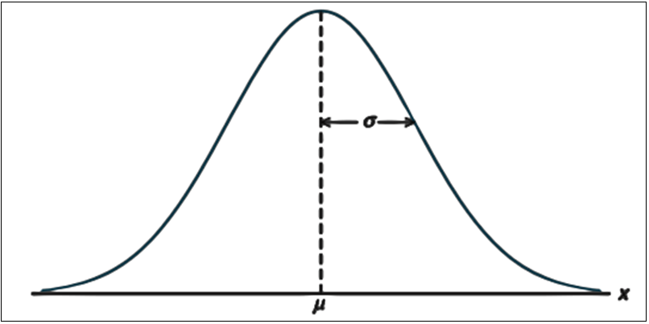

# Some special continous random variables

## Exponential r.v

In many situations, such as when modeling waiting times, inter-arrival times, the lifespan of hardware, breakdown times, and the intervals between phone calls, the exponential distribution is utilized. The time (suppose $T$) between rare events in Poisson process with arrival rate $\lambda$ (*number of arrival per unit time*) can be treated as exponential r.v.

-   **PDF:** $f(t)=\lambda e^{-\lambda t}; t> 0$

-   **CDF:** $F(t)=P(T\le t)=P(T< t)=1-e^{-\lambda t}; t> 0$

    Hence, $P(T> t)=1-P(T\le t)=1-F(t)=e^{-\lambda t}$

-   **Mean:** $E(T)=\frac{1}{\lambda}$

-   **Variance:** $Var(T)=\frac{1}{\lambda^2}$

**We write,** $T\sim Exp(\lambda)$

```{r echo=FALSE, fig.height=3.5,fig.width=6}

t <- seq(0,5,0.1)

#plot(t,dexp(t,0.5),type = "l")

exp1<-dexp(t,0.5)
exp2<-dexp(t,1 )
exp3<-dexp(t,1.5)

wide.exp<-data.frame(t,exp1,exp2,exp3)
#wide.ps

long.exp<-wide.exp%>%gather(key = "rate",value = "density",-t)
#head(long.ps)

long.exp$rate<-factor(long.exp$rate,labels = c("0.5","1","1.5"))
#head(long.exp)

long.exp%>%ggplot(aes(t,density,color=rate))+
   geom_line(lwd=0.7)+
   #facet_wrap(~rate,labeller = label_parsed)+
   scale_x_continuous(breaks = seq(0, 5, 1.5),limits=c(0, 5))+
   labs(x="t (Time) ",y="f(t)",
        title =expression(paste("Exponential probability density functions for selected values of"," ",lambda )),
        color=expression(paste(lambda,"(Arrival rate)")))+
   theme_bw()+
  theme(legend.position = "right",
        plot.title = element_text(size = 14),
        plot.background = element_rect(color = "black"))

```

The quantity $\lambda$ is a parameter of Exponential distribution, and its meaning is clear from $E(T) = \frac{1}{\lambda}$ . If T is time, measured in minutes, then $\lambda$ is a frequency, measured in $min^{-1}$. For example, if arrivals occur every half a minute, on the average, then $E(T) = 0.5$min and $\lambda=2$, saying that they occur with a frequency (arrival rate) of 2 arrivals per minute. This $\lambda$ has the same meaning as the parameter of Poisson distribution[@baron_probability_2019].

**Example 4.5**[@baron_probability_2019] Jobs are sent to a printer at an average rate of 3 jobs per hour.

(a) What is the expected time between jobs?

(b) What is the probability that the next job is sent within 5 minutes?

***Solution:*** Given, number of jobs per hour, $\lambda=3\ \ hr^{-1}$ per hour. Let, $T$=time elapsed between jobs (hour).

So, $T\sim Exp(\lambda)$

(a) $E(T)=\frac{1}{\lambda} hr=\frac{1}{3} hr=20\ \ mins$;
(b) Here, $5 \ \ mins=\frac{5}{60} hr=\frac{1}{12} hr$ We know, $F(t)=1-e^{-\lambda t}; t>0$

So, $P(T<5 \ \ mins)=P(T<\frac{1}{12})=F(\frac{1}{12})=1-e^{-3*\frac{1}{12}}=0.22$

**Example 4.58** [@navidi_statistics_2011] A radioactive mass emits particles according to a Poisson process at a mean rate of 15 particles per minute. At some point, a clock is started. What is the probability that more than 5 seconds will elapse before the next emission? What is the mean waiting time until the next particle is emitted?

***Solution***

Let, $T=elapsed \ \ time \ \ before \ \ the \ \ next \ \ emission (in \ \ second)$

Given, $\lambda=15 min^{-1}=\frac{15}{60} s^{-1}=0.25 s^{-1}$ and

$T\sim Exp(\lambda)$;

$P(T\le t)=F(t)=1-e^{-\lambda t}$

*P(more than 5 seconds will elapse before the next emission)*=$P(T>5)=e^{-\lambda * 5}=e^{-0.25*5}=0.2865$

*Mean waiting time*, $E(T)=\frac{1}{\lambda} s=\frac{1}{0.25}s=4s$

**Lack of Memory Property**

If $T \sim Exp(\lambda)$, and $t$ and $s$ are positive numbers, then

$$P(T> t+s| T> s)=P(T> t)$$

The probability that we must wait additional $t$ units, given that we have already waited $s$ units, is the same as the probability that we must wait $t$ units from the start. The exponential distribution does not "*remember*" how long we have been waiting.

-   In particular, if the lifetime of a component follows the exponential distribution, then the probability that a component that is $s$ time units old will last an additional $t$ time units is the same as the probability that a new component will last $t$ time units.

-   In other words, a component whose lifetime follows an exponential distribution does not show any effects of age or wear[@navidi_statistics_2011].

-   But if the failure of the component is a result of gradual or slow wear (as in mechanical wear), then the exponential does not apply and either the **gamma** or the **Weibull distribution** (see [@walpole_probability_2017, Section 6.10) may be more appropriate.

**Example 4.59**[@navidi_statistics_2011] The lifetime of a particular integrated circuit has an exponential distribution with mean 2 years. Find the probability that the circuit lasts longer than three years.

**Example 4.60**[@navidi_statistics_2011] Refer to Example 4.59. Assume the circuit is now four years old and is still functioning. Find the probability that it functions for more than three additional years (Hints: Apply Lack of Memory Property).

**Exercises for Section 4.7**[@navidi_statistics_2011]

1.Let $T \sim Exp(0.45)$. Find $\mu_T, \sigma^2_T, P(T>3)$ and the median of $T$.

2.The time between requests to a web server is exponentially distributed with mean 0.5 seconds.

a.  What is the value of the parameter $\lambda$?
b.  What is the median time between requests?
c.  What is the standard deviation?
d.  What is the 80th percentile?
e.  Find the probability that more than one second elapses between requests.
f.  If there have been no requests for the past two seconds, what is the probability that there more than one additional second will elapse before the next request?

***Solution***

Let, $T=time \ \ between \ \ requests \ \ in \ \ second$

If, $T\sim Exp(\lambda)$; then it is given that

$E(T)=0.5 \ \ second$

$\implies \frac{1}{\lambda}=0.5 \ \ second$

**a.** $\therefore \lambda=2 s^{-1}$

b.  If $M$ is the median time between request then,

$P(T \le M)=0.5$

$\implies F(M)=0.5$

$\implies 1-e^{-\lambda *M}=0.5$

$\implies e^{-\lambda *M}=0.5$

$\implies {-\lambda *M}=ln(0.5)$

$\implies M =\frac{ln(0.5)}{-\lambda}=\frac{ln(0.5)}{-2}=0.3466\approx0.35$

So, median time between request is $0.35s$

c.  Standard deviation of $T$, $\sigma_T=\frac{1}{\lambda}s=1/2 =0.5 s$

d.  Let, $P_{80}$ denotes 80th percentile.

So, solve the following equation for $P_{80}$

$P(T\le P_{80})=0.80)$

$\implies F(P_{80})=0.80$

$\implies P_{80}=\frac {ln(0.80)}{-\lambda}=0.11$

$\therefore P_{80}=0.11 s$

e.  $P(T>1)=e^{-\lambda *1}=0.1353$

f.  If there have been no requests for the past two seconds, the probability that there more than ***one*** **additional second** will elapse before the next request is:

$P(T>1+2 /T>2)=P(T>1)=e^{-\lambda *1}=0.1353$ $$by using *Lack of memory property*$$

8.A radioactive mass emits particles according to a Poisson process at a mean rate of 2 per second. Let T be the waiting time, in seconds, between emissions.

a.  What is the mean waiting time?
b.  What is the median waiting time?
c.  Find $P(T > 2)$. Hint:$P(T > 2)=e^{-\lambda *2}$ 
d.  Find $P(T < 0.1)$.Hint:$P(T < 0.1)=F(0.1)$
e.  Find $P(0.3< T < 1.5)$. Hint:$P(0.3< T < 1.5)=F(1.5)-F(0.3)$
f.  If 3 seconds have elapsed with no emission, what is the probability that there will be an emission within the next second? (Use Lack of Memory Property)

**Solution of f.** 

Since T is exponentially distributed and hold lack of memory property, so it dose not matter what was happened in past 3 seconds. We have to just compute that *there will be an emission (event will occur) within the next second*. So,

$P(T<1)=F(1)=1-e^{-\lambda*1}$ (*do yourself*)

## Normal or Gaussian r.v

The most important probability distribution for describing a continuous random variable is the **normal probability distribution**. The normal distribution has been used in a wide variety of practical applications in which the random variables are heights and weights of people, test scores, scientific measurements, amounts of rainfall, and other similar values.

**Definition**

A continuous random variable say $X$ is said to be normally distributed if it has the following PDF:

$$
f(x)=\frac{1}{\sigma\sqrt{2\pi}}e^{-\frac{1}{2}(\frac{x-\mu}{\sigma})^2}; -\infty<x<+\infty
$$

{width="50%" fig-align="left"}

The normal curve has two parameters, $\mu$ and $\sigma$. They determine the location and shape of the normal distribution.

-   **We write,** $X\sim N(\mu,\sigma)$
-   $E(X)=\mu$
-   $Var(X)=\sigma^2$

**Standard normal distribution**

If $X\sim N(\mu,\sigma)$ then $Z\sim N(0,1)$ ,where

$$Z=\frac{(X-\mu)}{\sigma}$$ The r.v $Z$ is called **standard normal variable**.

-   **PDF of** $Z$: $f(z)=\frac{1}{\sqrt{2\pi}}e^{-\frac{z^2}{2}};-\infty<z<+\infty$

-   **CDF of** $Z$: $\Phi(z)=P(Z\le z)=\int_{-\infty}^{z}f(z)dz$

*Due to symmetry*, $\Phi(-z)=1-\Phi(z)$

-   $E(Z)=0$

-   $Var(Z)=1$

**Area under standard normal curve**

For a given value of $z$, $\Phi(z)$ can be easily evaluated from z-table or calculator. *For example*,

-   $P(Z\le 1.5)=\Phi(1.5)=0.9332$

-   $P(Z\ge 1.5)=1-P(<1.5)=1-\Phi(1.5)=1-0.9332=0.0668$

    *Alternative:* $P(Z\ge 1.5)=P(Z< -1.5)=\Phi(-1.5)=$ `r round(pnorm(-1.5),4)`

-   $P(-1.8<Z<2.1)=\Phi(2.1)-\Phi(-1.8)=$ `r round(pnorm(2.1),4)`-`r round(pnorm(-1.8),4)`=`r round(pnorm(2.1),4)-round(pnorm(-1.8),4)`

**Area under normal curve**

Suppose, $X \sim N(\mu, \sigma)$. Then

$$
P(X\le x)=P(\frac{X-\mu}{\sigma}\le \frac{x-\mu}{\sigma})=P(Z\le \frac{x-\mu}{\sigma})=\Phi(\frac{x-\mu}{\sigma})
$$

*Due to symmetry*,

$$
P(X\ge x)=\Phi(\frac{\mu-x}{\sigma})
$$

**Example:** Suppose, $X \sim N(10, 2)$. Find $P(X<8)$, $P(X>14)$, $P(10<X<12)$.

*Solution:*

We know, $P(X\le x)=\Phi(\frac{x-\mu}{\sigma})$ and $P(X\ge x)=\Phi(\frac{\mu-x}{\sigma})$

So,

-   $P(X<8)=\Phi(\frac{8-10}{2})=\Phi(-1)=$ `r round(pnorm(-1),4)`

-   $P(X>14)=\Phi(\frac{10-14}{2})=\Phi(-2)=$ `r round(pnorm(-2),4)`

-   $P(10<X<12)=\Phi(\frac{12-10}{2})-\Phi(\frac{10-10}{2})=\Phi(1)-\Phi(0)=0.3413$

**Your turn:** Suppose, $X \sim N(10, 2)$. Find P(X\>14) and P(9\<X\<11).

**Using the Normal Curve in Reverse**

We know, $P(Z\le z)=\Phi(z)$.

Suppose, $z$ is *unknown* and it is given that, $\Phi(z)=p$.

Then, $z=\Phi^{-1}(p)$

**Example:** Given, $P(Z \le z)=0.9495$. Find the value of $z$.

*Solution:*

We know $P(Z\le z)=\Phi(z)$.

Given, $\Phi(z)=0.9495$

$\therefore z=\Phi^{-1}(p)=\Phi^{-1}(0.9495)=1.64$ $$From z-table, or calculator$$

**Exercise 6.7**[@walpole_probability_2017] Given a standard normal distribution, find the value of $k$ such that:

(a) P (Z \> k) = 0.2946; (b) P (Z \<k) = 0.0427; (c) P (-0.93 \< Z \< k) = 0.7235.

**Relation with X**

If, $P(X\le x)=p$; then

$x=\mu+z*\sigma$; where, $z=\Phi^{-1}(p)$

**Exercise 6.9**[@walpole_probability_2017] Given the normally distributed variable $X$ with mean 18 and standard deviation 2.5, find:

(a) P (X \< 15); (b) the value of k such that P (X \< k) = 0.2236;
(b) the value of k such that P (X \> k) = 0.1814;

**Finding percentiles:** Given,$X\sim N(20,4)$. Compute 75th percentile ($P_{75}$)

**Solution** To find $P_{75}$, we have to solve the following equation:

$P(X \le P_{75})=0.75$

$\Rightarrow P_{75}=\mu+ z*\sigma$; where $z=\Phi ^{-1}(0.75)$=`r round(qnorm(0.75),2)`

$\Rightarrow P_{75}=20+ (0.67)*4=22.68$

```{r echo=FALSE}

curve(dnorm(x,20,4),5,35,ylab = "f(x)",
      main=expression(paste(75^th, percentile,(P[75])," ",of," " ,X)))
axis(1,at=seq(5,35,1),labels = NA)
nx<-seq(5,qnorm(0.75,20,4),.01)
lines(nx,dnorm(nx,20,4),type = "h",col="grey70")
text(qnorm(0.75,15,4),.02,expression(paste(P(X<=P[75]),"=0.75")))
text(qnorm(0.75,20,4),0,expression(paste(P[75],"=22.68")))
```


**H.W:** Given,$X\sim N(18,2.5)$. Find $50^{th}$ percentile ($P_{50}$) and $90^{th}$ percentile ($P_{90}$) of $X$.

**Applications of the Normal Distribution**[@walpole_probability_2017]

**Example 6.7**: A certain type of storage battery lasts, on average, 3.0 years with a standard deviation of 0.5 year. Assuming that battery life is normally distributed, find the probability that a given battery will last less than 2.3 years.

**Example 6.8** : An electrical firm manufactures light bulbs that have a life, before burn-out, that is normally distributed with mean equal to 800 hours and a standard deviation of 40 hours. Find the probability that a bulb burns between 778 and 834 hours.

**Example 6.9** : In an industrial process, the diameter of a ball bearing is an important measurement. The buyer sets specifications for the diameter to be $3.0 \pm 0.01$ cm. The implication is that no part falling outside these specifications will be accepted. It is known that in the process the diameter of a ball bearing has a normal distribution with mean $\mu = 3.0$ and standard deviation $\sigma = 0.005$. On average, how many manufactured ball bearings will be scrapped?

**Example 6.10** : Gauges are used to reject all components for which a certain dimension is not within the specification $1.50 \pm d$. It is known that this measurement is normally distributed with a mean of 1.50 and a standard deviation of 0.2. Determine the value d such that the specifications "cover" 95% of the measurements.

**Solution:**

Let, $X=measurement \ \ of \ \ certain \ \ dimension$

Given, $X\sim N(1.5,0.2)$

According to question,

$P(1.5-d<X<1.5+d)=0.95$

So, $P(X<1.5-d)+P(X>1.5+d)=0.05$


So, $P(X <1.5-d)=0.025$

$\implies 1.5-d=\mu+z*\sigma$

$\implies 1.5-d=1.5+(-1.96)*0.2$.

[Since,$z=\Phi^{-1}(0.025)=-1.96$]

$\implies 1.5-d=1.108$

$\therefore d=0.392$

**Exercise 6.11** : A soft-drink machine is regulated so that it discharges an average of 200 milliliters per cup. If the amount of drink is normally distributed with a standard deviation equal to 15 milliliters,

(a) what fraction of the cups will contain more than 224 milliliters?
(b) what is the probability that a cup contains between 191 and 209 milliliters?
(c) how many cups will probably overflow if 230-milliliter cups are used for the next 1000 drinks?
(d) below what value do we get the smallest 25% of the drinks?

**Exercise 6.14** The finished inside diameter of a piston ring is normally distributed with a mean of 10 centimeters and a standard deviation of 0.03 centimeter.

(a) What proportion of rings will have inside diameters exceeding 10.075 centimeters?
(b) What is the probability that a piston ring will have an inside diameter between 9.97 and 10.03 centimeters?
(c) Below what value of inside diameter will 15% of the piston rings fall?

**Exercise 6.17** : The average life of a certain type of small motor is 10 years with a standard deviation of 2 years. The manufacturer replaces free all motors that fail while under guarantee. If she is willing to replace only 3% of the motors that fail, how long a guarantee should be offered? Assume that the lifetime of a motor follows a normal distribution.