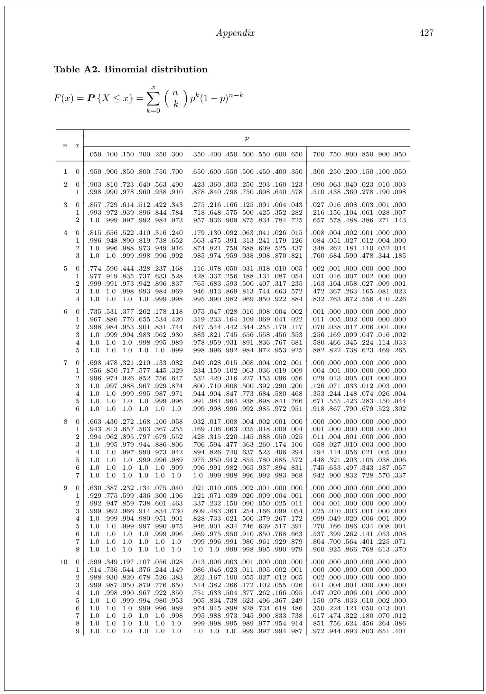
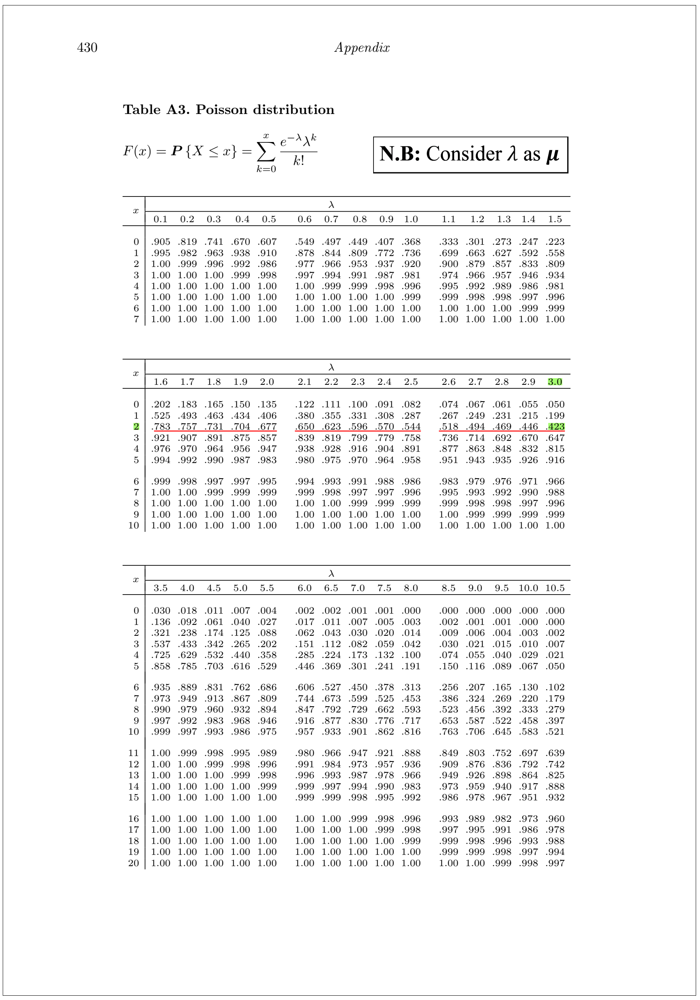

```{r setup, include=FALSE}
knitr::opts_chunk$set(echo = TRUE)
```

# Preface {.unnumbered}

This study manual is specially written for the honors students of engineering discipline like CSE, EEE and Textile.

<!--chapter:end:index.Rmd-->

# Introduction to statistics

<!--chapter:end:1Introduction_to_statistics_1.Rmd-->


# Probability

<!--chapter:end:2Probability_2.Rmd-->

# Random variable

<!--chapter:end:3Random_variable_3.Rmd-->

---
output: html_document
editor_options: 
  chunk_output_type: console
---

# Some special discrete random variables

## Bernoulli r.v

-   **PMF**: $P(X=x)=f(x)=p^x(1-p)^{1-x}; \ \ x=0,1$
-   **Mean**: $\mu=E(X)=p$
-   **Variance**: $\sigma^2 =E(X-\mu)^2=E(X^2)-\mu^2=p(1-p)$

## Binomial r.v

-   Consider an experiment of tossing a biased coin 3(number of trials, n) times.
-   Tosses are *independent*, each toss has only **TWO** Outcomes-*Head (Success)* and *Tail (Failure)*

**This type of trial is called the *Bernoulli Trial***

-   Suppose, $P(H)=p$ and remain constant in each toss, consequently, $P(T)=1-p=q$ (let).

**Suppose**, $X=\# \ \ of\ \ head\ \ (successes)\ \  in\ \ 3\ \ tosses$

Now, what is the probability that, we will have **exactly 2 heads (success) in 3 tosses?**

**That is,** $P(X=2)=?$

Now, this can happen in the following ways:

$$P(X=2)=P(HHT)+P(HTH)+P(THH)$$ $$=P(H)P(H)P(T)+P(H)P(T)P(H)+P(T)P(H)P(H)$$ [*Since tosses are independent*]

$$=p.p.q+p.q.p+q.p.p$$ $$=p^2 q+p^2 q+p^2 q=3p^2 q$$ $$\therefore P(X=2)=\binom{3}{2}p^2q^{3-2}$$ If, $p=0.6$ is given, then we can easily compute $P(X=2)=f(2)$. Now, if we repeat the toss 10 times $(n=10)$, with $P(H)=p$, what is the value of $P(X=3)=f(3)$?

**So**, for $n$ independent Bernoulli trials with a constant probability of success, $p$, the probability mass function (PMF) of the random variable, $X$=# of successes in $n$ trials is given below:

-   **PMF**:$P(X=x)=f(x)=\binom{n}{x} p^x (1-p)^x ;x=0,1,2,...,n$

-   **CDF**: $P(X\le x)=F(x)=f(0)+f(1)+...+f(x)$

-   **Mean**:$\mu=E(X)=np$

-   **Variance**:$\sigma^2 =np(1-p)$

-   **We write** $X\sim Binom(n,p)$

-   $n$ and $p$ are said to be the *parameters* of the Binomial distribution.

**N.B:** $f(x)=F(x)-F(x-1)$ i.e $f(3)=F(3)-F(2)$

**Probability plot of binomial r.v for different values of** $p$ and shape characteristics

```{r message=FALSE,warning=FALSE, echo=FALSE,fig.height=3}
library(tidyverse)
success <- 0:10
p1<-dbinom(success, size=10, prob=.2)
p2<-dbinom(success, size=10, prob=.5)
p3<-dbinom(success, size=10, prob=.8)

wide.df<-data.frame(success,p1,p2,p3)
#wide.df
wide.long<-wide.df%>%gather(key = "p",value = "prob",-success)
#head(wide.long)

wide.long<-wide.long%>%
        mutate(p=recode(p,
                        "p1"="n=10,p=0.2, positively skewed",
                        "p2"="n=10,p=0.5, symmetric",
                        "p3"="n=10,p=0.8, negatively skewed"))
wide.long%>%ggplot(aes(success,prob))+
        geom_col(width = .3,fill="black")+
        facet_wrap(~p)+
        scale_x_continuous(breaks = seq(0, length(success), 1),
                           limits=c(0, length(success)))+
        labs(x="x=# of success",y="f(x)",
             title = "Probability plot" )+
  theme_bw()+
  theme(axis.title = element_text(face = "italic"),
                         plot.background = element_rect(color = "black"))
```

**Finding Binomial probability manually**

Suppose, $X\sim Binom(n,p)$; where $n=5$ and $p=0.6$. Find, *(i)* $P(X=2)$ *(ii)* $P(X \le 2)$ *(iii)* $P(X\ge3)$.

***Solution:***

**PMF of** $X$: $P(X=x)=f(x)=\binom{5}{x} 0.6^x (0.4)^{5-x} \ \ ;x=0,1,2,...,5$

*(i)* $P(X=2)=f(2)=\binom{5}{2} 0.6^2 (0.4)^{5-2}=0.2304$

*(ii)* $P(X \le 2)=F(2)=f(0)+f(1)+f(2)=0.0102+0.0768+0.2304=0.3174$

*(iii)* $P(X \ge 3)=f(3)+f(4)+f(5)=0.6826$

***Alternative:(iii)***

$P(X \ge 3)=1-P(X< 3)=1-P(X \le 2)=1-F(2)=1-0.3174=0.6826$

**Finding Binomial probability using Binomial Table**

In the end of any Statistics book there are some **Probability Distribution Table**. We can use these table to compute the required probability for *specific values of the parameters* of certain probability distribution. Here I share the 1st page of **Binomial distribution table** [@baron_probability_2019].



```{r echo=FALSE}
#
```

**Suppose**, $X\sim Binom(n,p)$; where $n=5$ and $p=0.6$. Find, *(i)* $P(X=2)$ *(ii)* $P(X \le 2)$ *(iii)* $P(X \ge 3)$ using **Table**.

***Solution:***

*(i)* $P(X=2)=f(2)=F(2)-F(1)=0.3174-0.0870=0.2304$.

*(ii)* $P(X\le 2=F(2)=0.3174$

*(iii)* $P(X \ge 3)=1-P(X< 3)=1-F(2)=1-0.3174=0.6826$


**Exercise**[@walpole_probability_2017]

**5.9** In testing a certain kind of truck tire over rugged terrain, it is found that 25% of the trucks fail to complete the test run without a blowout. Of the next 15 trucks tested, find the probability that: (a) from 3 to 6 have blowouts; (b) fewer than 4 have blowouts; (c) more than 5 have blowouts.

***Solution**:*

Let, *X= number of trucks that have blowouts*

Given, $n=15; \ \ p=Pr(blowout)=0.25; \ \ q=1-p=0.75$. Hence, $X\sim Binom(n=15, p=0.25)$, that is:

$$
P(X=x)=f(x)=\binom{15}{x}(0.25)^x (0.75)^{15-x}; x=0,1,2,...,15.
$$

```{r echo=FALSE,message=FALSE,warning=FALSE}

p1=dbinom(3,15,0.25)
p2=pbinom(6,15,0.25)-pbinom(2,15,0.25)

```

Now,

**(a)** $P(3\le X\le 6)=f(3)+f(4)+f(5)+f(6)$=`r round(dbinom(3,15,0.25),3)`+`r round(dbinom(4,15,0.25),3)`+`r round(dbinom(5,15,0.25),3)`+`r round(dbinom(6,15,0.25),3)`=`r round(pbinom(6,15,0.25),3)-round(pbinom(2,15,0.25),3)`.

***Alternative:*** $P(3\le X\le 6)=F(6)-F(2)=0.943-0.236=0.707$ \[from **Table**\]

**(b)** $P(X<4)=f(0)+f(1)+f(2)+f(3)$=`r round(dbinom(0,15,0.25),3)`+`r round(dbinom(1,15,0.25),3)`+`r round(dbinom(2,15,0.25),3)`+`r round(dbinom(3,15,0.25),3)`=`r round(pbinom(3,15,0.25),3)`.

***Alternative:*** $P(X< 4)=F(3)=0.461$ \[from **Table A2**\]

**(c)** $P(X > 5)=1-P(X \le 5)=1-F(5)$=`r 1-round(pbinom(5,15,0.25),3)`

**5.12** A traffic control engineer reports that 75% of the vehicles passing through a checkpoint are from within the state. What is the probability that fewer than 4 of the next 9 vehicles are from out of state?

**5.16** Suppose that airplane engines operate independently and fail with probability equal to 0.4. Assuming that a plane makes a safe flight if at least one-half of its engines run, determine whether a 4-engine plane or a 2-engine plane has the higher probability for a successful flight.

**5.25** Suppose that for a very large shipment of integrated-circuit chips, the probability of failure for any one chip is 0.10. Assuming that the assumptions underlying the binomial distributions are met, find the probability that at most 3 chips fail in a random sample of 20.

**Exercise**[@montgomery_applied_2014]

**3-93** Let $X$ be a binomial random variable with $p = 0.1$ . and $n = 10$. Calculate the following probabilities from the binomial probability mass function and from the binomial table in Appendix A and compare results. (a) $P(X\le 2)$ (b) P(X\>8) (c) P(X = 4) (d) $P(5 \le X \le7)$

**3-115** The probability that a visitor to a Web site provides contact data for additional information is 0.01. Assume that 1000 visitors to the site behave independently. Determine the following probabilities: (a) No visitor provides contact data. (b) Exactly 10 visitors provide contact data. (c) More than 3 visitors provide contact data

**Exercise**[@baron_probability_2019]

**3.21.** A lab network consisting of 20 computers was attacked by a computer virus. This virus enters each computer with probability 0.4, independently of other computers. Find the probability that it entered at least 10 computers.

**3.22.** Five percent of computer parts produced by a certain supplier are defective. What is the probability that a sample of 16 parts contains more than 3 defective ones?

*And so on....*

## Poisson r.v

The number of events occur randomly in an interval or in a region usually follows Poisson distribution. A famous French mathematician *SimB4eon-Denis Poisson* (1781--1840) first introduced this distribution.

**Example**

The Poisson distribution may be useful to model variables like:

-   The *no. of calls* arrive at a customer care in *15 minites*
-   The *no. of arrivals* at a car wash in *one hour*
-   The *no. of repairs* needed in *10 miles* of highway
-   The *no. of leaks* in *100 miles* of pipeline etc.

Usually Poisson distribution is used to evaluate probability of "*Rare*" event.

The probability mass function of the Poisson random variable $X$, representing the *number of outcomes* occurring in a given time interval denoted by $t$, is:

-   **PMF**: $P(X=x)=f(x)=\frac{e^{-\lambda t}(\lambda t)^x}{x!}; \ \ x=0,1,2,...,\infty.$

Here, $\lambda$ is called *arrival rate* or *average number of occurrences* in long-run. And only *parameter* of Poisson distribution.

-   **Mean**: $\mu=E(X)=\lambda t$

-   **Variance**: $\sigma^2 =\lambda t$

-   **We write:** $X\sim Pois(\lambda t)$

**N.B**: The mean and variance of Poisson random random variable are *identical*. This is the *unique property* of Poisson r.v.

**Probability of plot of poisson r.v for different values of** $\lambda$ (for a fixed interval $t=1$)

```{r echo=FALSE, warning=FALSE,fig.height=2.5}

success <- 0:10
ps1<-dpois(success,1 )
ps2<-dpois(success,3 )
ps3<-dpois(success, 5)

wide.ps<-data.frame(success,ps1,ps2,ps3)
#wide.ps

long.ps<-wide.ps%>%gather(key = "p",value = "prob",-success)
#head(long.ps)

long.ps$p<-factor(long.ps$p,labels = c("lambda=={1}","lambda=={3}","lambda=={5}"))
#head(long.ps)

long.ps%>%ggplot(aes(success,prob))+
   geom_col(width = .3,fill="black")+
   facet_wrap(~p,labeller = label_parsed)+
   scale_x_continuous(breaks = seq(0, length(success), 1),
                      limits=c(0, length(success)))+
   labs(x="x = # of success",y="f(x)",
        subtitle =expression(paste("Probability plot of Poissoin PMF for different values of"," ",lambda )))+
   theme_bw()+
  theme(plot.background = element_rect(color = "black"))

```

We can see that, for small $\lambda$ the distribution of Poisson r.v is positively skewed and as the value of $\lambda$ increases the distribution tends to symmetry.

**Finding Poisson probability**

Consider a discrete r.v say $X\sim Pois(\lambda t)$. Suppose, $\lambda =1.5$ and $t=2$. Find, (i) P(X=4) (ii)$P(X \le 2)$ (iii) $P(X\ge3)$.

***Solution***:

**PMF** of $X$: $P(X=x)=f(x)=\frac{e^{-\lambda t}(\lambda t)^x}{x!}; x=0,1,...,\infty.$

**(i)** For $t=2$ , $\mu=\lambda t=1.5*2=3$.

So, $P(X=4)=f(4)=\frac{e^{-3}(3)^4}{4!}$=`r round(dpois(4,3),3)`.

**(ii)** $P(X\le2)=\sum_{x=0}^{2}f(x)=\sum_{x=0}^{2}\frac{e^{-3}(3)^x}{x!}=e^{-3}[\frac{3^0}{0!}+\frac{3^1}{1!}+\frac{3^2}{2!}]$=`r round(ppois(2,3),3)`.

**(iii)** $P(X \ge 3)=1-P(X< 3)=1-P(X\le 2)=1-0.423=0.577$

**Finding Poisson probability using Table**

We can use Poisson distribution table to compute Poisson probabilities. Here I share the 1st page of **Poisson distribution table** [@baron_probability_2019].


```{r echo=FALSE}
#
```

**Consider** a discrete r.v say $X\sim Pois(\lambda t)$. Suppose, $\lambda =1.5$ and $t=2$. **Find**, (i) $P(X \le 2)$ (ii)P(X=4)

***Solution by using Table***:

For $t=2$ , $\mu=\lambda t=1.5*2=3$.

**(i)** $P(X \le 2)=F(2)=0.423$

[For x=2 and $\mu \ \ or \ \lambda =3$; corresponding probability in **Table A3** is 0.423]

**(ii)** $P(X=4)=f(4)=F(4)-F(3)=0.815-0.647=0.168$

**Example 5.17:**[@walpole_probability_2017] During a laboratory experiment, the average number of radioactive particles passing through a counter in 1 millisecond is 4. What is the probability that 6 particles enter the counter in a given millisecond?

**Example 5.18:**[@walpole_probability_2017] Ten is the average number of oil tankers arriving each day at a certain port. The facilities at the port can handle at most 15 tankers per day. What is the probability that on a given day tankers have to be turned away?

**Example 3.8:**[@pishro-nik_introduction_2014] The number of emails that I get in a weekday can be modeled by a Poisson distribution with an average of 0.2 emails per minute.

1.  What is the probability that I get no emails in an interval of length 5 minutes?

2.  What is the probability that I get more than 3 emails in an interval of length 10 minutes?

***Solution***

Let, $X$=number of emails that I get in a given interval.

Given, $\lambda =0.2 \ \ min^{-1}$.

$X$ will follow $Pois(\lambda t)$

**1.** In this case $\mu=\lambda t=0.2*5=1$. **So**, $P(X=0)=f(0)=e^{-\mu}=e^{-1}=0.3679$.

**2.** In this case $\mu=\lambda t=0.2*10=2$. **So**,$P(X>3)=1-P(X\le 3)=1-F(3)=1-0.857=0.143$. \[From **Table A3**\]

**Approximation of Binomial Distribution to Poisson**

When,

-   $p \rightarrow0$ (*Success rate is very low*);

-   $n\rightarrow \infty$ (*Number of trials is very large*);

Then **Binomial distribution** can be *approximated* by **Poisson distribution**.

-   Mathematically, $Binom (x; n,p)\approx Pois(\lambda)$; where $\lambda=np$.

**N.B: In practical situation** if $n \ge 30$ and $p\le 0.05$ ;hence $q\ge 0.95$,then the approximation is close enough to use the Poisson distribution for binomial problems[@baron_probability_2019].

**Example 5.20:**[@walpole_probability_2017] In a manufacturing process where glass products are made, defects or bubbles occur, occasionally rendering the piece undesirable for marketing. It is known that, on average, 1 in every 1000 of these items produced has one or more bubbles. What is the probability that a random sample of 8000 will yield fewer than 7 items possessing bubbles?

***Solution:***

Let,$X=number\ \ of \ \ glasses\ \ possesing\ \ bubbles$

Given, $Pr(buuble \ \ occurs)=p=1/1000=0.001$ which is less than $0.05$, and $n=8000$ which is greater than $30$. So, the PMF of $X$ can be approximated by Poisson distribution with

$$\lambda =np=8000*0.001=8$$ that is $X\sim Pois (\lambda=8)$

According to question,

$P(X<7)=f(0)+f(1)+...+f(6)=F(6)=0.313$ (*Ans.*)

[By using **Table A3**]

**Exercise 5.87:**[@walpole_probability_2017] Imperfections in computer circuit boards and computer chips lend themselves to statistical treatment. For a particular type of board, the probability of a diode failure is 0.03 and the board contains 200 diodes.

(a) What is the mean number of failures among the diodes? (***Ans:*** $\mu=np=200*0.03=6$)
(b) What is the variance?(***Ans:*** $\sigma^2=np(1-p)=200*0.03*(1-0.03)=5.82$)
(c) The board will work if there are no defective diodes. What is the probability that a board will work? ***Ans (c):*** The board will work if there are no defective diodes. So, P(The board will work)=$P(X=0)=f(0)=e^{-\mu}=e^{-6}=0.0025$

<!--chapter:end:4Some_special_discrete_random_variables_4.Rmd-->

```{r echo=FALSE,warning=FALSE,message=FALSE}
library(tidyverse)

```


# Continuous random variable

A fundamental difference separates discrete and continuous random variables in terms of how probabilities are computed. For a discrete random variable, the PMF $f(x)$ provides the probability that the random variable assumes a particular value.

With continuous random variables, the counterpart of the probability function is the *probability density function (PDF)*, also denoted by $f(x)$. The difference is that the probability density function does not directly provide probabilities. However, the area under the graph of $f(x)$ corresponding to a given interval does provide the probability that the continuous random variable x assumes a value in that interval.

**So when we compute probabilities for continuous random variables we are computing the probability that the random variable assumes any value in an interval.**

**Definition**

The function $f(x)$ is said to be *probability density function (PDF)* for the continuous random variable $X$, defined over the set of real numbers, if

1.  $f(x)\ge0; all\ \ x\in R$
2.  $\int_{-\infty}^{+\infty} f(x)dx=1$
3.  $P(a< X < b)=\int_{a}^{b} f(x)dx$

{width="60%"}

**N.B:** $P(X=a)=0$ as well as $P(X=b)=0$. So, $P(X\le a )$ is same as $P(X<a)$.

**CDF of** $X$: By definition, CDF, $F(x)=P(X\le x)= \int_{-\infty}^{x} f(x)dx$

Therefore, $f(x)=\frac{d}{dx} F(x)$.

**Expectation and variance of continuous r.v**

-   **Mean**: $E(X)=\int x.f(x)dx$
-   **Variance**: $\sigma^2=E(X-\mu)^2=\int(x-\mu)^2 f(x)=\int x^2 f(x)dx-\mu^2$

**Example 3.11**[@walpole_probability_2017] Suppose that the error in the reaction temperature, in $^0C$, for a controlled laboratory experiment is a continuous random variable X having the probability density function

$$
f(x)=\frac{x^2}{3}; -1<x<2.
$$

(a) Verify that $f(x)$ is a density function.
(b) Find $P(0< X \le 1)$.

**Example 3.12**[@walpole_probability_2017] Find $F(x)$, and use it to evaluate $P(0 < X\le1)$.

**H.W:** Find E(X) and Var(X) where,$f(x)=\frac{x^2}{3}; -1<x<2$.

**Exercise 3.29**[@walpole_probability_2017] An important factor in solid missile fuel is the particle size distribution. Significant problems occur if the particle sizes are too large. From production data in the past, it has been determined that the particle size (in micrometers) distribution is characterized by 

$$
f(x)=3x^{-4}; x> 1
$$

(a) Verify that this is a valid density function.
(b) Evaluate $F(x)$.
(c) What is the probability that a random particle from the manufactured fuel exceeds 4 micrometers?

**Exercise 3.69**[@walpole_probability_2017] The life span in hours of an electrical component is a random variable with cumulative distribution function $$
F(x)=1-e^{-\frac{x}{50}}; x>0
$$

(a) Determine its probability density function (PDF).

(b) Determine the probability that the life span of such a component will exceed 70 hours.

<!--chapter:end:5Continuous_rv_5.Rmd-->

# Some special continous random variables

## Exponential r.v

In many situations, such as when modeling waiting times, inter-arrival times, the lifespan of hardware, breakdown times, and the intervals between phone calls, the exponential distribution is utilized. The time (suppose $T$) between rare events in Poisson process with arrival rate $\lambda$ (*number of arrival per unit time*) can be treated as exponential r.v.

-   **PDF:** $f(t)=\lambda e^{-\lambda t}; t> 0$

-   **CDF:** $F(t)=P(T\le t)=P(T< t)=1-e^{-\lambda t}; t> 0$

    Hence, $P(T> t)=1-P(T\le t)=1-F(t)=e^{-\lambda t}$

-   **Mean:** $E(T)=\frac{1}{\lambda}$

-   **Variance:** $Var(T)=\frac{1}{\lambda^2}$

**We write,** $T\sim Exp(\lambda)$

```{r echo=FALSE, fig.height=3.5,fig.width=6}

t <- seq(0,5,0.1)

#plot(t,dexp(t,0.5),type = "l")

exp1<-dexp(t,0.5)
exp2<-dexp(t,1 )
exp3<-dexp(t,1.5)

wide.exp<-data.frame(t,exp1,exp2,exp3)
#wide.ps

long.exp<-wide.exp%>%gather(key = "rate",value = "density",-t)
#head(long.ps)

long.exp$rate<-factor(long.exp$rate,labels = c("0.5","1","1.5"))
#head(long.exp)

long.exp%>%ggplot(aes(t,density,color=rate))+
   geom_line(lwd=0.7)+
   #facet_wrap(~rate,labeller = label_parsed)+
   scale_x_continuous(breaks = seq(0, 5, 1.5),limits=c(0, 5))+
   labs(x="t (Time) ",y="f(t)",
        title =expression(paste("Exponential probability density functions for selected values of"," ",lambda )),
        color=expression(paste(lambda,"(Arrival rate)")))+
   theme_bw()+
  theme(legend.position = "right",
        plot.title = element_text(size = 14),
        plot.background = element_rect(color = "black"))

```

The quantity $\lambda$ is a parameter of Exponential distribution, and its meaning is clear from $E(T) = \frac{1}{\lambda}$ . If T is time, measured in minutes, then $\lambda$ is a frequency, measured in $min^{-1}$. For example, if arrivals occur every half a minute, on the average, then $E(T) = 0.5$min and $\lambda=2$, saying that they occur with a frequency (arrival rate) of 2 arrivals per minute. This $\lambda$ has the same meaning as the parameter of Poisson distribution[@baron_probability_2019].

**Example 4.5**[@baron_probability_2019] Jobs are sent to a printer at an average rate of 3 jobs per hour.

(a) What is the expected time between jobs?

(b) What is the probability that the next job is sent within 5 minutes?

***Solution:*** Given, number of jobs per hour, $\lambda=3\ \ hr^{-1}$ per hour. Let, $T$=time elapsed between jobs (hour).

So, $T\sim Exp(\lambda)$

(a) $E(T)=\frac{1}{\lambda} hr=\frac{1}{3} hr=20\ \ mins$;
(b) Here, $5 \ \ mins=\frac{5}{60} hr=\frac{1}{12} hr$ We know, $F(t)=1-e^{-\lambda t}; t>0$

So, $P(T<5 \ \ mins)=P(T<\frac{1}{12})=F(\frac{1}{12})=1-e^{-3*\frac{1}{12}}=0.22$

**Example 4.58** [@navidi_statistics_2011] A radioactive mass emits particles according to a Poisson process at a mean rate of 15 particles per minute. At some point, a clock is started. What is the probability that more than 5 seconds will elapse before the next emission? What is the mean waiting time until the next particle is emitted?

***Solution***

Let, $T=elapsed \ \ time \ \ before \ \ the \ \ next \ \ emission (in \ \ second)$

Given, $\lambda=15 min^{-1}=\frac{15}{60} s^{-1}=0.25 s^{-1}$ and

$T\sim Exp(\lambda)$;

$P(T\le t)=F(t)=1-e^{-\lambda t}$

*P(more than 5 seconds will elapse before the next emission)*=$P(T>5)=e^{-\lambda * 5}=e^{-0.25*5}=0.2865$

*Mean waiting time*, $E(T)=\frac{1}{\lambda} s=\frac{1}{0.25}s=4s$

**Lack of Memory Property**

If $T \sim Exp(\lambda)$, and $t$ and $s$ are positive numbers, then

$$P(T> t+s| T> s)=P(T> t)$$

The probability that we must wait additional $t$ units, given that we have already waited $s$ units, is the same as the probability that we must wait $t$ units from the start. The exponential distribution does not "*remember*" how long we have been waiting.

-   In particular, if the lifetime of a component follows the exponential distribution, then the probability that a component that is $s$ time units old will last an additional $t$ time units is the same as the probability that a new component will last $t$ time units.

-   In other words, a component whose lifetime follows an exponential distribution does not show any effects of age or wear[@navidi_statistics_2011].

-   But if the failure of the component is a result of gradual or slow wear (as in mechanical wear), then the exponential does not apply and either the **gamma** or the **Weibull distribution** (see [@walpole_probability_2017, Section 6.10) may be more appropriate.

**Example 4.59**[@navidi_statistics_2011] The lifetime of a particular integrated circuit has an exponential distribution with mean 2 years. Find the probability that the circuit lasts longer than three years.

**Example 4.60**[@navidi_statistics_2011] Refer to Example 4.59. Assume the circuit is now four years old and is still functioning. Find the probability that it functions for more than three additional years (Hints: Apply Lack of Memory Property).

**Exercises for Section 4.7**[@navidi_statistics_2011]

1.Let $T \sim Exp(0.45)$. Find $\mu_T, \sigma^2_T, P(T>3)$ and the median of $T$.

2.The time between requests to a web server is exponentially distributed with mean 0.5 seconds.

a.  What is the value of the parameter $\lambda$?
b.  What is the median time between requests?
c.  What is the standard deviation?
d.  What is the 80th percentile?
e.  Find the probability that more than one second elapses between requests.
f.  If there have been no requests for the past two seconds, what is the probability that there more than one additional second will elapse before the next request?

***Solution***

Let, $T=time \ \ between \ \ requests \ \ in \ \ second$

If, $T\sim Exp(\lambda)$; then it is given that

$E(T)=0.5 \ \ second$

$\implies \frac{1}{\lambda}=0.5 \ \ second$

**a.** $\therefore \lambda=2 s^{-1}$

b.  If $M$ is the median time between request then,

$P(T \le M)=0.5$

$\implies F(M)=0.5$

$\implies 1-e^{-\lambda *M}=0.5$

$\implies e^{-\lambda *M}=0.5$

$\implies {-\lambda *M}=ln(0.5)$

$\implies M =\frac{ln(0.5)}{-\lambda}=\frac{ln(0.5)}{-2}=0.3466\approx0.35$

So, median time between request is $0.35s$

c.  Standard deviation of $T$, $\sigma_T=\frac{1}{\lambda}s=1/2 =0.5 s$

d.  Let, $P_{80}$ denotes 80th percentile.

So, solve the following equation for $P_{80}$

$P(T\le P_{80})=0.80)$

$\implies F(P_{80})=0.80$

$\implies P_{80}=\frac {ln(0.80)}{-\lambda}=0.11$

$\therefore P_{80}=0.11 s$

e.  $P(T>1)=e^{-\lambda *1}=0.1353$

f.  If there have been no requests for the past two seconds, the probability that there more than ***one*** **additional second** will elapse before the next request is:

$P(T>1+2 /T>2)=P(T>1)=e^{-\lambda *1}=0.1353$ $$by using *Lack of memory property*$$

8.A radioactive mass emits particles according to a Poisson process at a mean rate of 2 per second. Let T be the waiting time, in seconds, between emissions.

a.  What is the mean waiting time?
b.  What is the median waiting time?
c.  Find $P(T > 2)$. Hint:$P(T > 2)=e^{-\lambda *2}$ 
d.  Find $P(T < 0.1)$.Hint:$P(T < 0.1)=F(0.1)$
e.  Find $P(0.3< T < 1.5)$. Hint:$P(0.3< T < 1.5)=F(1.5)-F(0.3)$
f.  If 3 seconds have elapsed with no emission, what is the probability that there will be an emission within the next second? (Use Lack of Memory Property)

**Solution of f.** 

Since T is exponentially distributed and hold lack of memory property, so it dose not matter what was happened in past 3 seconds. We have to just compute that *there will be an emission (event will occur) within the next second*. So,

$P(T<1)=F(1)=1-e^{-\lambda*1}$ (*do yourself*)

## Normal or Gaussian r.v

The most important probability distribution for describing a continuous random variable is the **normal probability distribution**. The normal distribution has been used in a wide variety of practical applications in which the random variables are heights and weights of people, test scores, scientific measurements, amounts of rainfall, and other similar values.

**Definition**

A continuous random variable say $X$ is said to be normally distributed if it has the following PDF:

$$
f(x)=\frac{1}{\sigma\sqrt{2\pi}}e^{-\frac{1}{2}(\frac{x-\mu}{\sigma})^2}; -\infty<x<+\infty
$$

{width="50%" fig-align="left"}

The normal curve has two parameters, $\mu$ and $\sigma$. They determine the location and shape of the normal distribution.

-   **We write,** $X\sim N(\mu,\sigma)$
-   $E(X)=\mu$
-   $Var(X)=\sigma^2$

**Standard normal distribution**

If $X\sim N(\mu,\sigma)$ then $Z\sim N(0,1)$ ,where

$$Z=\frac{(X-\mu)}{\sigma}$$ The r.v $Z$ is called **standard normal variable**.

-   **PDF of** $Z$: $f(z)=\frac{1}{\sqrt{2\pi}}e^{-\frac{z^2}{2}};-\infty<z<+\infty$

-   **CDF of** $Z$: $\Phi(z)=P(Z\le z)=\int_{-\infty}^{z}f(z)dz$

*Due to symmetry*, $\Phi(-z)=1-\Phi(z)$

-   $E(Z)=0$

-   $Var(Z)=1$

**Area under standard normal curve**

For a given value of $z$, $\Phi(z)$ can be easily evaluated from z-table or calculator. *For example*,

-   $P(Z\le 1.5)=\Phi(1.5)=0.9332$

-   $P(Z\ge 1.5)=1-P(<1.5)=1-\Phi(1.5)=1-0.9332=0.0668$

    *Alternative:* $P(Z\ge 1.5)=P(Z< -1.5)=\Phi(-1.5)=$ `r round(pnorm(-1.5),4)`

-   $P(-1.8<Z<2.1)=\Phi(2.1)-\Phi(-1.8)=$ `r round(pnorm(2.1),4)`-`r round(pnorm(-1.8),4)`=`r round(pnorm(2.1),4)-round(pnorm(-1.8),4)`

**Area under normal curve**

Suppose, $X \sim N(\mu, \sigma)$. Then

$$
P(X\le x)=P(\frac{X-\mu}{\sigma}\le \frac{x-\mu}{\sigma})=P(Z\le \frac{x-\mu}{\sigma})=\Phi(\frac{x-\mu}{\sigma})
$$

*Due to symmetry*,

$$
P(X\ge x)=\Phi(\frac{\mu-x}{\sigma})
$$

**Example:** Suppose, $X \sim N(10, 2)$. Find $P(X<8)$, $P(X>14)$, $P(10<X<12)$.

*Solution:*

We know, $P(X\le x)=\Phi(\frac{x-\mu}{\sigma})$ and $P(X\ge x)=\Phi(\frac{\mu-x}{\sigma})$

So,

-   $P(X<8)=\Phi(\frac{8-10}{2})=\Phi(-1)=$ `r round(pnorm(-1),4)`

-   $P(X>14)=\Phi(\frac{10-14}{2})=\Phi(-2)=$ `r round(pnorm(-2),4)`

-   $P(10<X<12)=\Phi(\frac{12-10}{2})-\Phi(\frac{10-10}{2})=\Phi(1)-\Phi(0)=0.3413$

**Your turn:** Suppose, $X \sim N(10, 2)$. Find P(X\>14) and P(9\<X\<11).

**Using the Normal Curve in Reverse**

We know, $P(Z\le z)=\Phi(z)$.

Suppose, $z$ is *unknown* and it is given that, $\Phi(z)=p$.

Then, $z=\Phi^{-1}(p)$

**Example:** Given, $P(Z \le z)=0.9495$. Find the value of $z$.

*Solution:*

We know $P(Z\le z)=\Phi(z)$.

Given, $\Phi(z)=0.9495$

$\therefore z=\Phi^{-1}(p)=\Phi^{-1}(0.9495)=1.64$ $$From z-table, or calculator$$

**Exercise 6.7**[@walpole_probability_2017] Given a standard normal distribution, find the value of $k$ such that:

(a) P (Z \> k) = 0.2946; (b) P (Z \<k) = 0.0427; (c) P (-0.93 \< Z \< k) = 0.7235.

**Relation with X**

If, $P(X\le x)=p$; then

$x=\mu+z*\sigma$; where, $z=\Phi^{-1}(p)$

**Exercise 6.9**[@walpole_probability_2017] Given the normally distributed variable $X$ with mean 18 and standard deviation 2.5, find:

(a) P (X \< 15); (b) the value of k such that P (X \< k) = 0.2236;
(b) the value of k such that P (X \> k) = 0.1814;

**Finding percentiles:** Given,$X\sim N(20,4)$. Compute 75th percentile ($P_{75}$)

**Solution** To find $P_{75}$, we have to solve the following equation:

$P(X \le P_{75})=0.75$

$\Rightarrow P_{75}=\mu+ z*\sigma$; where $z=\Phi ^{-1}(0.75)$=`r round(qnorm(0.75),2)`

$\Rightarrow P_{75}=20+ (0.67)*4=22.68$

```{r echo=FALSE}

curve(dnorm(x,20,4),5,35,ylab = "f(x)",
      main=expression(paste(75^th, percentile,(P[75])," ",of," " ,X)))
axis(1,at=seq(5,35,1),labels = NA)
nx<-seq(5,qnorm(0.75,20,4),.01)
lines(nx,dnorm(nx,20,4),type = "h",col="grey70")
text(qnorm(0.75,15,4),.02,expression(paste(P(X<=P[75]),"=0.75")))
text(qnorm(0.75,20,4),0,expression(paste(P[75],"=22.68")))
```


**H.W:** Given,$X\sim N(18,2.5)$. Find $50^{th}$ percentile ($P_{50}$) and $90^{th}$ percentile ($P_{90}$) of $X$.

**Applications of the Normal Distribution**[@walpole_probability_2017]

**Example 6.7**: A certain type of storage battery lasts, on average, 3.0 years with a standard deviation of 0.5 year. Assuming that battery life is normally distributed, find the probability that a given battery will last less than 2.3 years.

**Example 6.8** : An electrical firm manufactures light bulbs that have a life, before burn-out, that is normally distributed with mean equal to 800 hours and a standard deviation of 40 hours. Find the probability that a bulb burns between 778 and 834 hours.

**Example 6.9** : In an industrial process, the diameter of a ball bearing is an important measurement. The buyer sets specifications for the diameter to be $3.0 \pm 0.01$ cm. The implication is that no part falling outside these specifications will be accepted. It is known that in the process the diameter of a ball bearing has a normal distribution with mean $\mu = 3.0$ and standard deviation $\sigma = 0.005$. On average, how many manufactured ball bearings will be scrapped?

**Example 6.10** : Gauges are used to reject all components for which a certain dimension is not within the specification $1.50 \pm d$. It is known that this measurement is normally distributed with a mean of 1.50 and a standard deviation of 0.2. Determine the value d such that the specifications "cover" 95% of the measurements.

**Solution:**

Let, $X=measurement \ \ of \ \ certain \ \ dimension$

Given, $X\sim N(1.5,0.2)$

According to question,

$P(1.5-d<X<1.5+d)=0.95$

So, $P(X<1.5-d)+P(X>1.5+d)=0.05$


So, $P(X <1.5-d)=0.025$

$\implies 1.5-d=\mu+z*\sigma$

$\implies 1.5-d=1.5+(-1.96)*0.2$. [Since,$z=\Phi^{-1}(0.025)=-1.96$]

$1.5-d=1.108$

$\therefore d=0.392$

**Exercise 6.11** : A soft-drink machine is regulated so that it discharges an average of 200 milliliters per cup. If the amount of drink is normally distributed with a standard deviation equal to 15 milliliters,

(a) what fraction of the cups will contain more than 224 milliliters?
(b) what is the probability that a cup contains between 191 and 209 milliliters?
(c) how many cups will probably overflow if 230-milliliter cups are used for the next 1000 drinks?
(d) below what value do we get the smallest 25% of the drinks?

**Exercise 6.14** The finished inside diameter of a piston ring is normally distributed with a mean of 10 centimeters and a standard deviation of 0.03 centimeter.

(a) What proportion of rings will have inside diameters exceeding 10.075 centimeters?
(b) What is the probability that a piston ring will have an inside diameter between 9.97 and 10.03 centimeters?
(c) Below what value of inside diameter will 15% of the piston rings fall?

**Exercise 6.17** : The average life of a certain type of small motor is 10 years with a standard deviation of 2 years. The manufacturer replaces free all motors that fail while under guarantee. If she is willing to replace only 3% of the motors that fail, how long a guarantee should be offered? Assume that the lifetime of a motor follows a normal distribution.

<!--chapter:end:6Some_special_continuous_rv.Rmd-->

`r if (knitr:::is_html_output()) '
# References {-}
'`

<!--chapter:end:99References.Rmd-->

